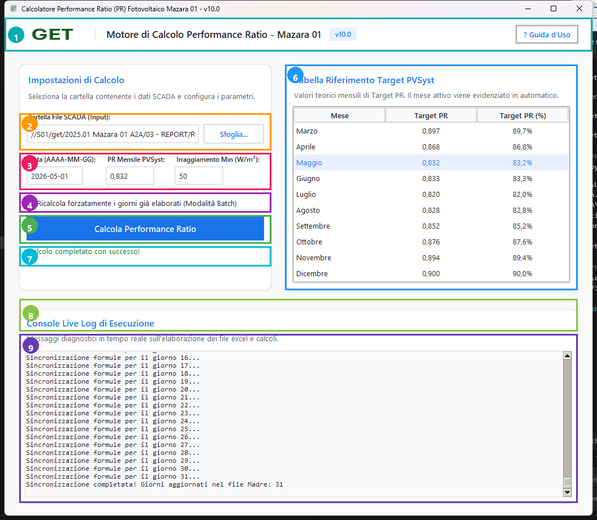

# PV Plant Performance Ratio (PR) Calculator - Mazara 01 (v10.0)

A professional, high-performance Python-based tool designed for the **GET S.R.L.** Mazara 01 photovoltaic plant. This application automates the calculation of the Performance Ratio (PR), providing both raw and compensated metrics by processing SCADA data and weather station logs.



## Features

- **Automated Calculation Engine**: Processes 15-minute interval data for active power, solar irradiance (POA), and energy meter readings.
- **Compensated PR Analysis**: Intelligent logic to account for:
    - **Curtailment Losses**: Energy lost due to grid-imposed power limits.
    - **Downtime Losses**: Energy lost during inverter or transformer outages.
- **PR Compensated Formula Integration (v10.0)**: Writes the live PR Compensated mathematical formula directly into Excel daily child files (`BH11`) and automatically links it to the Mother file.
- **Italian Decimal formatting**: Handles commas for decimal entry and display in GUI while preserving proper float numbers during Excel generation.
- **Batch Processing Mode**: Processes a month's data in a single run, utilizing a high-speed single-pass sync that minimizes Excel startup overhead.
- **Excel Automation via ActiveX**: Utilizes Excel COM for seamless report generation, avoiding `openpyxl` table corruption and ensuring that complex formulas and styles remain uncorrupted.
- **Mother-Child File Syncing (Self-Healing)**: Automatically scans and links monthly "Mother" files with data from daily "Child" recalculation files via dynamic Excel formulas. If the file is locked, it reports descriptive errors to the user instead of failing silently.
- **Direct Loss Write (v7.0+)**: Python-computed per-inverter energy losses are written directly to the Excel loss columns (O–Z for TX1, AB–AM for TX2, AO–AZ for TX3), bypassing Excel formula dependency.
- **Obsidian Dark Mode Interface**: A premium, luxury-themed GUI built with Tkinter, featuring real-time logging, interactive controls, and performance metrics.

## Prerequisites

To run the source code, you need Windows (for Excel COM integration), Microsoft Excel installed, and Python 3.8+ with the following libraries:

```bash
pip install pandas numpy openpyxl pywin32 Pillow
```

## Installation & Setup

1. **Clone the Repository**:
   ```bash
   git clone https://github.com/MuhammadAbbasi/PV-Plant-PR-Calculator.git
   cd PV-Plant-PR-Calculator
   ```

2. **Template Configuration**:
   Ensure the `original_format/` directory contains the required Excel templates:
   - `00 PR_recalculation_*.xlsx` (Monthly Mother file)
   - `PR_recalculation_26_apr.xlsx` (Pristine daily template - *Version 10.0 aligned*)

3. **Assets**:
   Place company logos in the `assets/` folder (`logo.png`, `logo.ico`).

## How to Use

1. **Launch the Application**:
   Run the GUI using Python:
   ```bash
   python PR_Calculator_GUI_v10.py
   ```
   Or run the compiled executable:
   ```bash
   "PR Calculator v10.exe"
   ```

2. **Single Day Processing**:
   - Select the folder containing the SCADA files for the specific day.
   - Enter the target date (`YYYY-MM-DD`).
   - Click **"Calcola Performance Ratio"**.

3. **Batch Processing (Monthly)**:
   - Select a parent folder containing subfolders named by day (e.g., `01`, `02`, `03` ... `31`).
   - Check **"Ricalcola forzatamente i giorni già elaborati"** to overwrite existing daily workbooks.
   - The tool will iterate through every day, generate individual child workbooks, and sync them to the monthly Mother file.

---

## 📊 Excel Templates & Formatting Requirements (v10.0)

The tool automates calculations by reading from and writing to specific sheets, columns, and cells within two template types. Below are the formatting requirements to ensure compatibility:

### 1. Daily "Child" Workbook (`PR_recalculation_*.xlsx`)
Must contain at least two worksheets with the following exact names and structure:

*   **`PR_Calc` Sheet**:
    *   **Row 14**: Headers row. Columns `AA`, `AB`, and `AC` are dynamically set to:
        *   `AA14`: `"Energy Loss for TX1\nkW/H"`
        *   `AB14`: `"Inverter status TX2-INV-1"`
        *   `AC14`: `"Inverter status TX2-INV-2"`
    *   **Rows 15 to 110 (96 intervals of 15 min)**:
        *   Column `A`: Date (`YYYY-MM-DD`)
        *   Column `B`: Time slot (`HH:MM:SS` from `00:00:00` to `23:45:00`)
        *   Column `C` & `D`: POA1 (W/m²) and POA1 (kWh/m²)
        *   Column `E` & `F`: POA3 (W/m²) and POA3 (kWh/m²)
        *   Column `K`: Meter Previous Reading (SATAC)
        *   Column `L`: Meter Current Reading (SATAC)
        *   Column `N`: Active Power Regulation Limit Ratio (expressed as a decimal, e.g., `0.876`)
    *   **Formula Cells (Rows 15 to 110)**: Autopopulated with exact Excel formulas to prevent `#DIV/0!` errors:
        *   Column `G` (POA Avg): `=IFERROR((D{r}+F{r})/2, 0)`
        *   Column `H` (POA threshold check): `=IFERROR(IF(AVERAGE(C{r},E{r})>$BA$7,AVERAGE(C{r},E{r}),0), 0)`
        *   Column `I` (POA max check): `=IFERROR(IF(AND(D{r}=0,F{r}=0),0,IF(H{r}>$BA$6,MAX(D{r},F{r}),G{r})), 0)`
        *   Column `J` (POA difference ratio): `=IFERROR(IF(AND(D{r}>0,F{r}>0),ABS(D{r}-F{r})/AVERAGE(D{r},F{r}),0), 0)`
        *   Column `M` (Active Energy production): `=IFERROR((L{r}-K{r})*1000, 0)`
    *   **Nominal Parameters (Column BA)**:
        *   `BA4`: PVSyst PR Target as decimal (e.g., `0.897` written from GUI)
        *   `BA6`: Irradiance acceptance limit ratio (e.g., `0.03`)
        *   `BA7`: Minimum Irradiance threshold (e.g., `50` written from GUI)
    *   **Shifted Parameters Table (Columns BD & BH)**:
        *   `BD2`: English PR title header (e.g., `"1 May 2026 PR Calculation"`)
        *   `BH3`: Total values count (`=+BA3`)
        *   `BH4`: Total values with POA > 0 (`=COUNTIF(H15:H110,">0")`)
        *   `BH5`: PVSyst PR for current month in % (`=+BA4*100`)
        *   `BH6`: RAW PR in % (`=+BA5*100`)
        *   `BH7`: Average of each PR in % (`=AVERAGE(...)*100`)
        *   `BH8`: **PR from SCADA (Uncompensated PR % written from GUI, e.g., `37.529`)**
        *   `BH9`: Irradiance acceptance limit ratio (`=+BA6*100`)
        *   `BH10`: Minimum Irradiance threshold (`=+BA7`)
        *   `BH11`: **PR Compensated [%] (Active Excel formula written from GUI)**:
            `=((SUM(Inverter_data!C15:N110, Inverter_data!R15:AC110, Inverter_data!AG15:AR110)*0.25 + AA111 + AN111 + BA111) / (12625 * (SUM($H$15:$H$110)*0.25/1000))) * 100`

*   **`Inverter_data` Sheet**:
    *   **Rows 15 to 110**:
        *   Column `A`: Date (`YYYY-MM-DD`)
        *   Columns `C` to `N` (12 columns): Active power for **TX1-INV-1** to **TX1-INV-12** (kW)
        *   Columns `R` to `AC` (12 columns): Active power for **TX2-INV-1** to **TX2-INV-12** (kW)
        *   Columns `AG` to `AR` (12 columns): Active power for **TX3-INV-1** to **TX3-INV-12** (kW)

### 2. Monthly "Mother" Workbook (`00 PR_recalculation_*.xlsx`)
Must contain a **`PR_Calc`** sheet structured as follows:
*   **Column `A`**: Date sequence for the entire month (Rows 5 to `5 + num_days - 1`).
*   **Columns `B` to `M` (Day Rows)**: Auto-linked formulas referencing the corresponding child workbook:
    *   Column `B` (Irradiance TX1): `='[ChildPath]PR_Calc'!$D$111`
    *   Column `C` (Irradiance TX3): `='[ChildPath]PR_Calc'!$F$111`
    *   Column `D` (Irradiance [kWh/m2]): `='[ChildPath]PR_Calc'!$I$111`
    *   Column `E` (Energy [kWh]): `='[ChildPath]PR_Calc'!$M$111`
    *   Column `F` (PR Target [%]): `='[ChildPath]PR_Calc'!$BH$5`
    *   Column `G` (PR Total [%]): `='[ChildPath]PR_Calc'!$BH$6` (or `='[ChildPath]PR_Calc'!$BA$5*100`)
    *   Column `H` (PR VCOM [%]): `='[ChildPath]PR_Calc'!$BH$8`
    *   Column `I` (PR Compensated [%]): **`='[ChildPath]PR_Calc'!$BH$11`**
    *   Column `J` (External Availability [%]): `=IF(E{r}="",0,(E{r}/(E{r}+K{r}+L{r}+M{r}))*100)`
    *   Column `K` (TX1 Energy Loss): `='[ChildPath]PR_Calc'!$AA$111`
    *   Column `L` (TX2 Energy Loss): `='[ChildPath]PR_Calc'!$AN$111`
    *   Column `M` (TX3 Energy Loss): `='[ChildPath]PR_Calc'!$BA$111`
*   **Inverter Columns (Columns N to AW)**: Linked to corresponding child row 111 per-inverter calculated PR.
*   **Summary Row**: Dynamically positioned at Row `5 + num_days` containing appropriate sums and averages.

---

## Changelog

### v10.0
- **New Feature**: Added `PR Compensated` calculation using active formula written to daily cell `BH11`.
- **New Feature**: Linked daily `BH11` to Column I (`PR Compensated`) of the Mother file.
- **New Feature**: Added automatic insertion of `External Availability [%]` in Column J of the Mother file.
- **UI Update**: Decimal separator in GUI inputs changed to comma (Italian locale rules) while preserving native Excel numeric formats.
- **Bug fix**: Resolved OLE/COM Excel list separator formatting errors under Italian locale for cell range formatting.

### v7.0
- **Bug fix**: Energy loss values (TX1/TX2/TX3) were reported 100× too small in all Excel output files. Root cause: the PVSyst PR parameter written to cell `BA4` was divided by 100 twice (`pvsyst_pr / 100.0` when the value is already stored as a decimal, e.g. `0.897`).
- **Fix**: `BA4` is now written as `float(pvsyst_pr)` directly.
- **Fix**: Python-computed per-inverter energy losses are written directly to the PR_Calc sheet (columns O–Z for TX1, AB–AM for TX2, AO–AZ for TX3) as plain values.

---

## 🛠 Compilation (Building the Executable)

To bundle the application into a standalone Windows executable:

```powershell
pyinstaller --noconfirm "\\S01\get\2025.01 Mazara 01 A2A\03 - REPORT\Report\09 Testing\PR Calculation automation\PR Calculator v10.spec"
```

This will produce the compiled standalone **`PR Calculator v10.exe`** under the main folder.

---

## Developed By

**Muhammad Abbasi**  
*Data Scientist and Automation Engineer - GET S.R.L.*

---
*Note: This tool is specifically tailored for the Mazara 01 plant configuration but can be adapted for other PV infrastructures.*
