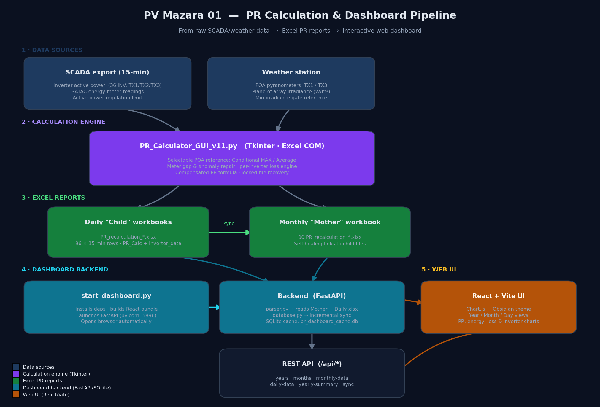

# PV Plant Performance Ratio (PR) Calculator & Dashboard - Mazara 01 (v12.0)

> **Document generated:** 2026-05-15 · **Last updated:** 2026-07-24

A professional, high-performance toolkit for the **GET S.R.L.** Mazara 01 photovoltaic plant. It has two components:

1. **PR Calculator (`PR_Calculator_GUI_v12.py`)** — a Tkinter desktop app that automates the Performance Ratio (PR) calculation, producing both raw and compensated metrics by processing SCADA data and weather-station logs into Excel reports.
2. **PR Dashboard (`pr_dashboard/`)** — a local FastAPI + React web app that reads the generated Excel reports into a SQLite cache and visualises PR, energy, losses and per-inverter performance across year / month / day views.



## Features

- **VCOM Fallback for Missing SCADA (v12.0)**: When a day lacks its SCADA exports, the app looks for a per-day `vcom/` folder holding `Potenza_AC_*.csv` + `Produzione_energetica_*.csv`. If absent, it offers to download them from the meteocontrol VCOM portal via Playwright (**headed browser**, so the extraction is visible), then converts the 5-minute VCOM exports into 15-minute pseudo-SCADA workbooks (`VCOM_to_SCADA.py`) and calculates the PR normally.
    - Conversion produces **6 of the 7** required files; `Regolazione_della_potenza_attiva_*.xlsx` still comes from the separate active-power extractor.
    - Frozen builds set `PLAYWRIGHT_BROWSERS_PATH` to `%LOCALAPPDATA%\ms-playwright`, fixing the PyInstaller `_MEIxxxxx` browser-not-found error.
- **Safe Stop (v12.0)**: An **Interrompi (arresto sicuro)** button requests cancellation instead of killing the run. The worker polls the flag at safe checkpoints (between days, between VCOM downloads/conversions), so the in-flight day finishes and is saved before halting; the Mother file is still synced for completed days, leaving output consistent.
- **Degradation-Adjusted Target Column (v12.0)**: The PVSyst reference table shows a **Target Corretto** column with the contractual 0.4%/year degraded target (Allegato 9.1, compounding from the Feb-2025 start, contract year running Feb–Jan), auto-recomputed for the selected date's year.
- **Selectable POA Reference (v11.0, default changed in v12.0)**: A themed segmented toggle chooses how the plane-of-array irradiance that drives every PR is derived from the two pyranometers (TX1/TX3):
    - **Media (Average)** — *default since v12.0*: the standard IEC two-sensor arithmetic mean. The differential-tolerance field is disabled in this mode.
    - **Conditional MAX** (conservative): uses the higher sensor when the two diverge beyond the user tolerance (protects against soiling-inflated PR).
    Both apply the minimum-irradiance gate and flow consistently into every PR figure (per-inverter, `BA5`, `BH11`).
- **Meter Gap & Anomaly Repair (v11.0)**: Missing, zero, or backwards (negative-delta) SATAC meter readings are detected and interpolated from the nearest valid neighbours; repaired cells are highlighted in orange with an explanatory note in the daily file.
- **Locked-File Recovery (v11.0)**: If a daily or Mother workbook is open in another Excel window, the tool prompts for confirmation and force-closes it (via the Running Object Table) instead of failing.
- **Automated Calculation Engine**: Processes 15-minute interval data for active power, solar irradiance (POA), and energy meter readings.
- **Compensated PR Analysis**: Intelligent logic to account for:
    - **Curtailment Losses**: Energy lost due to grid-imposed power limits.
    - **Downtime Losses**: Energy lost during inverter or transformer outages.
- **PR Compensated Formula Integration (v10.0)**: Writes the live PR Compensated mathematical formula directly into Excel daily child files (`BH11`) and automatically links it to the Mother file.
- **Italian Decimal formatting**: Handles commas for decimal entry and display in GUI while preserving proper float numbers during Excel generation.
- **Batch Processing Mode**: Processes a month's data in a single run, utilizing a high-speed single-pass sync that minimizes Excel startup overhead.
- **Excel Automation via ActiveX**: Utilizes Excel COM for seamless report generation, avoiding `openpyxl` table corruption and ensuring that complex formulas and styles remain uncorrupted.
- **Mother-Child File Syncing (Self-Healing)**: Automatically scans and links monthly "Mother" files with data from daily "Child" recalculation files via dynamic Excel formulas. If the file is locked, it reports descriptive errors to the user instead of failing silently.
- **Direct Loss Write (v7.0+)**: Python-computed per-inverter energy losses are written directly to the Excel loss columns (O–Z for TX1, AB–AM for TX2, AO–AZ for TX3), bypassing Excel formula dependency.
- **Obsidian Dark Mode Interface**: A premium, luxury-themed GUI built with Tkinter, featuring real-time logging, interactive controls, and performance metrics.

## Prerequisites

To run the source code, you need Windows (for Excel COM integration), Microsoft Excel installed, and Python 3.8+ with the following libraries:

```bash
pip install pandas numpy openpyxl pywin32 Pillow
```

## Installation & Setup

1. **Clone the Repository**:
   ```bash
   git clone https://github.com/MuhammadAbbasi/PV-Plant-PR-Calculator.git
   cd PV-Plant-PR-Calculator
   ```

2. **Template Configuration**:
   Ensure the `original_format/` directory (in the project root — the calculator loads its pristine templates from here at runtime) contains:
   - `00 PR_recalculation_*.xlsx` (Monthly Mother file)
   - `PR_recalculation_26_apr.xlsx` (Pristine daily template - *v11.0 aligned*)

3. **Assets**:
   Place company logos in the `assets/` folder (`logo.png`, `logo.ico`).

### Repository Structure

```
.
├── PR_Calculator_GUI_v12.py     # Current calculator (Tkinter desktop app)
├── VCOM_to_SCADA.py             # Converts 5-min VCOM CSVs -> 15-min pseudo-SCADA workbooks
├── start_dashboard.py           # One-command launcher for the web dashboard
├── pr_dashboard/                # PR Dashboard web app
│   ├── backend/                 # FastAPI API + SQLite cache + Excel parser
│   └── frontend/                # React + Vite UI (Chart.js)
├── original_format/             # Pristine Excel templates (loaded at runtime)
├── assets/                      # Logos and the flow diagram
├── Manuale_Utente_PR_Calculator.md / .html   # User manual (Italian)
└── archive/                     # Older versions, build artifacts and screenshots
```

## How to Use

1. **Launch the Application**:
   Run the GUI using Python:
   ```bash
   python PR_Calculator_GUI_v12.py
   ```
   Or run the compiled executable:
   ```bash
   "PR Calculator v12.exe"
   ```

2. **Single Day Processing**:
   - Select the folder containing the SCADA files for the specific day.
   - Enter the target date (`YYYY-MM-DD`).
   - Click **"Calcola Performance Ratio"**.

3. **Batch Processing (Monthly)**:
   - Select a parent folder containing subfolders named by day (e.g., `01`, `02`, `03` ... `31`).
   - Check **"Ricalcola forzatamente i giorni già elaborati"** to overwrite existing daily workbooks.
   - The tool will iterate through every day, generate individual child workbooks, and sync them to the monthly Mother file.

---

## 📈 PR Dashboard (Web App)

The `pr_dashboard/` component turns the Excel reports produced by the calculator into an interactive, browser-based dashboard. It never re-computes PR — it **reads and visualises** the Mother and daily Child workbooks.

### How it works

1. **Launch** — `python start_dashboard.py`. On first run this installs any missing Python packages (`fastapi`, `uvicorn`, …), runs `npm install` + `npm run build` for the React frontend, then starts a FastAPI server (uvicorn) on **http://127.0.0.1:5896** and opens the browser automatically.
2. **Sync** — on startup (and via the *Aggiorna* button / `POST /api/sync`) the backend scans the reports directory for `00 PR_recalculation_*.xlsx` (Mother) and `PR_recalculation_*.xlsx` (daily) files, parsing only those whose modification time changed (incremental cache).
3. **Cache** — parsed data is stored in a local SQLite database (`pr_dashboard_cache.db`) across four tables: `file_meta`, `monthly_summaries`, `daily_summaries`, and 15-minute `daily_intervals`.
4. **Visualise** — the React + Chart.js UI (Obsidian dark/light theme) offers **Year**, **Month** and **Day** views of PR (raw / SCADA / compensated), energy, availability, per-transformer losses, and per-inverter performance.

### Reports directory

The backend looks for reports at `../../../01 Daily Reports` relative to the project (the standard plant layout). Override it with an environment variable:

```powershell
$env:PR_REPORTS_DIR = "D:\path\to\01 Daily Reports"; python start_dashboard.py
```

### REST API

| Endpoint | Purpose |
| --- | --- |
| `GET /api/years` / `GET /api/months` | Available years / months in the cache |
| `GET /api/monthly-data?year=&month=` | Daily rows for a month (incl. inverter PRs) |
| `GET /api/daily-data?date=` | Daily summary + 15-minute intervals |
| `GET /api/yearly-summary?year=` | Monthly aggregates for a year |
| `GET /api/sync-status` · `POST /api/sync` | Cache/sync status and manual re-sync |

### Prerequisites (dashboard)

- Python 3.8+ with `fastapi` and `uvicorn` (auto-installed by the launcher)
- [Node.js](https://nodejs.org/) (npm) — required once to build the frontend bundle

---

## 📊 Excel Templates & Formatting Requirements (v11.0)

The tool automates calculations by reading from and writing to specific sheets, columns, and cells within two template types. Below are the formatting requirements to ensure compatibility:

### 1. Daily "Child" Workbook (`PR_recalculation_*.xlsx`)
Must contain at least two worksheets with the following exact names and structure:

*   **`PR_Calc` Sheet**:
    *   **Row 14**: Headers row. Columns `AA`, `AB`, and `AC` are dynamically set to:
        *   `AA14`: `"Energy Loss for TX1\nkW/H"`
        *   `AB14`: `"Inverter status TX2-INV-1"`
        *   `AC14`: `"Inverter status TX2-INV-2"`
    *   **Rows 15 to 110 (96 intervals of 15 min)**:
        *   Column `A`: Date (`YYYY-MM-DD`)
        *   Column `B`: Time slot (`HH:MM:SS` from `00:00:00` to `23:45:00`)
        *   Column `C` & `D`: POA1 (W/m²) and POA1 (kWh/m²)
        *   Column `E` & `F`: POA3 (W/m²) and POA3 (kWh/m²)
        *   Column `K`: Meter Previous Reading (SATAC)
        *   Column `L`: Meter Current Reading (SATAC)
        *   Column `N`: Active Power Regulation Limit Ratio (expressed as a decimal, e.g., `0.876`)
    *   **Formula Cells (Rows 15 to 110)**: Autopopulated with exact Excel formulas to prevent `#DIV/0!` errors:
        *   Column `G` (POA Avg, kWh/m²): `=IFERROR((D{r}+F{r})/2, 0)`
        *   Column `H` (POA average, W/m²; feeds the loss estimates): `=IFERROR(IF(OR(C{r}=0,E{r}=0),IF(MAX(C{r},E{r})>$BA$7,MAX(C{r},E{r}),0),IF(AVERAGE(C{r},E{r})>$BA$7,AVERAGE(C{r},E{r}),0)), 0)`
        *   **Column `I` (PR reference POA, kWh/m²)** — this is the irradiance the PR is divided by; its form depends on the **POA method** chosen in the GUI, and it is gated by the `>= $BA$7` minimum:
            *   *Conditional MAX*: `=IFERROR(IF(({sel})*4000>=$BA$7,{sel},0), 0)` where `{sel}` = `IF(AND(D{r}=0,F{r}=0),0,IF(OR(D{r}=0,F{r}=0),MAX(D{r},F{r}),IF(J{r}>$BA$6,MAX(D{r},F{r}),G{r})))`
            *   *Average*: same wrapper with `{sel}` = `IF(AND(D{r}=0,F{r}=0),0,IF(OR(D{r}=0,F{r}=0),MAX(D{r},F{r}),G{r}))` (no `$BA$6` deviation override)
        *   Column `J` (POA difference ratio): `=IFERROR(IF(AND(D{r}>0,F{r}>0),ABS(D{r}-F{r})/AVERAGE(D{r},F{r}),0), 0)`
        *   Column `M` (Active Energy production): `=IFERROR((L{r}-K{r})*1000, 0)` — note: rows whose meter reading was missing/anomalous are repaired (interpolated) and the `K/L/M` cells highlighted in orange with a note.
    *   **Nominal Parameters (Column BA)**:
        *   `BA4`: PVSyst PR Target as decimal (e.g., `0.897` written from GUI)
        *   `BA6`: POA deviation tolerance between TX1/TX3 for the Conditional MAX method (e.g. `0.10` = 10%, user-defined from GUI, default 10%; not used when the POA method is *Average*)
        *   `BA7`: Minimum Irradiance threshold (e.g., `50` written from GUI)
    *   **Shifted Parameters Table (Columns BD & BH)**:
        *   `BD2`: English PR title header (e.g., `"1 May 2026 PR Calculation"`)
        *   `BH3`: Total values count (`=+BA3`)
        *   `BH4`: Total values with POA > 0 (`=COUNTIF(H15:H110,">0")`)
        *   `BH5`: PVSyst PR for current month in % (`=+BA4*100`)
        *   `BH6`: RAW PR in % (`=+BA5*100`)
        *   `BH7`: Average of each PR in % (`=AVERAGE(...)*100`)
        *   `BH8`: **PR from SCADA (Uncompensated PR % written from GUI, e.g., `37.529`)**
        *   `BH9`: Irradiance acceptance limit ratio (`=+BA6*100`)
        *   `BH10`: Minimum Irradiance threshold (`=+BA7`)
        *   `BH11`: **PR Compensated [%] (Active Excel formula written from GUI)** — denominator references the PR reference POA in Column I:
            `=((SUM(Inverter_data!C15:N110, Inverter_data!R15:AC110, Inverter_data!AG15:AR110)*0.25 + AA111 + AN111 + BA111) / (12625 * SUM($I$15:$I$110))) * 100`

*   **`Inverter_data` Sheet**:
    *   **Rows 15 to 110**:
        *   Column `A`: Date (`YYYY-MM-DD`)
        *   Columns `C` to `N` (12 columns): Active power for **TX1-INV-1** to **TX1-INV-12** (kW)
        *   Columns `R` to `AC` (12 columns): Active power for **TX2-INV-1** to **TX2-INV-12** (kW)
        *   Columns `AG` to `AR` (12 columns): Active power for **TX3-INV-1** to **TX3-INV-12** (kW)

### 2. Monthly "Mother" Workbook (`00 PR_recalculation_*.xlsx`)
Must contain a **`PR_Calc`** sheet structured as follows:
*   **Column `A`**: Date sequence for the entire month (Rows 5 to `5 + num_days - 1`).
*   **Columns `B` to `M` (Day Rows)**: Auto-linked formulas referencing the corresponding child workbook:
    *   Column `B` (Irradiance TX1): `='[ChildPath]PR_Calc'!$D$111`
    *   Column `C` (Irradiance TX3): `='[ChildPath]PR_Calc'!$F$111`
    *   Column `D` (Irradiance [kWh/m2]): `='[ChildPath]PR_Calc'!$I$111`
    *   Column `E` (Energy [kWh]): `='[ChildPath]PR_Calc'!$M$111`
    *   Column `F` (PR Target [%]): `='[ChildPath]PR_Calc'!$BH$5`
    *   Column `G` (PR Total [%]): `='[ChildPath]PR_Calc'!$BH$6` (or `='[ChildPath]PR_Calc'!$BA$5*100`)
    *   Column `H` (PR VCOM [%]): `='[ChildPath]PR_Calc'!$BH$8`
    *   Column `I` (PR Compensated [%]): **`='[ChildPath]PR_Calc'!$BH$11`**
    *   Column `J` (External Availability [%]): `=IF(E{r}="",0,(E{r}/(E{r}+K{r}+L{r}+M{r}))*100)`
    *   Column `K` (TX1 Energy Loss): `='[ChildPath]PR_Calc'!$AA$111`
    *   Column `L` (TX2 Energy Loss): `='[ChildPath]PR_Calc'!$AN$111`
    *   Column `M` (TX3 Energy Loss): `='[ChildPath]PR_Calc'!$BA$111`
*   **Inverter Columns (Columns N to AW)**: Linked to corresponding child row 111 per-inverter calculated PR.
*   **Summary Row**: Dynamically positioned at Row `5 + num_days` containing appropriate sums and averages.

---

## Changelog

### v12.0 (2026-07-24)
- **New Feature — VCOM Fallback Pipeline**: Days missing SCADA exports are recovered from the meteocontrol VCOM portal. The app detects a per-day `vcom/`(or `VCOM/`) folder with `Potenza_AC_*.csv` + `Produzione_energetica_*.csv`, offers an automated Playwright download when absent, and converts the 5-minute exports into 15-minute pseudo-SCADA workbooks via `VCOM_to_SCADA.py` (SATAC meter, TS_01/03 weather POA, TS_01/02/03 inverters).
- **New Feature — Safe Stop**: `Interrompi (arresto sicuro)` button sets a cancellation flag polled at safe checkpoints (between days, between VCOM downloads/conversions). The in-flight day completes and is saved before halting; the Mother file is still synced for completed days.
- **New Feature — Degradation-Adjusted Target column**: The PVSyst reference table gained a `Target Corretto` column showing the 0.4%/year contractually degraded target (Allegato 9.1), recomputed for the selected date's year.
- **Change — POA default is now `Media (Average)`** (IEC two-sensor mean); the differential-tolerance field auto-disables in this mode. The POA selector is now a themed segmented control with the active choice filled in accent blue.
- **Bug fix — Playwright in frozen builds**: The compiled `.exe` resolved Playwright's browser path to the PyInstaller `_MEIxxxxx` temp dir and failed with *"Executable doesn't exist"*. `PLAYWRIGHT_BROWSERS_PATH` is now pointed at `%LOCALAPPDATA%\ms-playwright`. The extraction browser also runs **headed** so progress is visible.
- **UI fix — Layout**: The top grid was rebalanced to an equal split (was 4:5). The 4th PVSyst column had squeezed the left card, clipping the *"Ricalcola forzatamente…"* checkbox and the main button label. Descriptive/hint/status labels now wrap to the card width instead of clipping.

### PR Dashboard 1.0 (2026-07-09)
- **New Component — PR Dashboard**: Added `pr_dashboard/`, a local FastAPI + React/Vite web app that reads the generated Mother/daily Excel reports into a SQLite cache and visualises PR, energy, losses and per-inverter performance across Year / Month / Day views. Launch with `python start_dashboard.py`.

### v11.0
- **New Feature — POA Reference Toggle**: GUI selector for the PR reference irradiance — **Conditional MAX** (default, conservative) or **Media/Average** (IEC). The choice drives Column `I` of the daily file and therefore every PR figure (per-inverter row 111, `BA5`, `BH11`). Average yields a lower POA and thus a higher PR; pick one method and apply it consistently across periods.
- **Methodology**: PR is now referenced to the threshold-gated Column `I` (`SUM($I$15:$I$110)`) instead of Column `H`. The minimum-irradiance gate (`>= $BA$7`, e.g. 50 W/m²) is applied to the PR reference. Python engine and Excel formulas verified identical to machine precision.
- **New Feature — Meter Gap/Anomaly Repair**: Missing, zero, or backwards (negative-delta) SATAC meter readings are interpolated from the nearest valid neighbours; affected `K/L/M` cells are highlighted orange with an explanatory note, and the repair is logged.
- **New Feature — Locked-File Recovery**: When a daily or Mother workbook is open elsewhere in Excel, the tool asks for confirmation and force-closes it via the Running Object Table, then retries — instead of aborting.
- **Performance**: Daily formula columns are written in single bulk array calls (~480 → 5 COM round-trips per day).
- **Security/Safety**: Excel COM opened with `AutomationSecurity = ForceDisable` (no auto-run macros); the Mother file is backed up (timestamped, last 5 kept) before each overwrite.

### v10.0
- **New Feature**: Added user-controlled **Irradiance Difference Tolerance (%)** (value between 0% and 100%, default 10%) in the GUI to determine conditional max selection between weather stations TX1 and TX3, written to cell `BA6` in the daily worksheet.
- **New Feature**: Added `PR Compensated` calculation using active formula written to daily cell `BH11`.
- **New Feature**: Linked daily `BH11` to Column I (`PR Compensated`) of the Mother file.
- **New Feature**: Added automatic insertion of `External Availability [%]` in Column J of the Mother file.
- **UI Update**: Decimal separator in GUI inputs changed to comma (Italian locale rules) while preserving native Excel numeric formats.
- **Bug fix**: Resolved OLE/COM Excel list separator formatting errors under Italian locale for cell range formatting.

### v7.0
- **Bug fix**: Energy loss values (TX1/TX2/TX3) were reported 100× too small in all Excel output files. Root cause: the PVSyst PR parameter written to cell `BA4` was divided by 100 twice (`pvsyst_pr / 100.0` when the value is already stored as a decimal, e.g. `0.897`).
- **Fix**: `BA4` is now written as `float(pvsyst_pr)` directly.
- **Fix**: Python-computed per-inverter energy losses are written directly to the PR_Calc sheet (columns O–Z for TX1, AB–AM for TX2, AO–AZ for TX3) as plain values.

---

## 🛠 Compilation (Building the Executable)

To bundle the application into a standalone Windows executable:

```powershell
pyinstaller --noconfirm "\\S01\get\2025.01 Mazara 01 A2A\03 - REPORT\Report\09 Testing\PR Calculation automation\PR Calculator v12.spec"
```

This will produce the compiled standalone **`PR Calculator v12.exe`** under the main folder.

> **Note (v12.0):** the VCOM download uses Playwright. The bundled `.exe` does **not** ship the browsers — it reads them from the per-user cache via `PLAYWRIGHT_BROWSERS_PATH` (`%LOCALAPPDATA%\ms-playwright`). On a machine that has never run Playwright, install them once with `playwright install chromium`. **Rebuild the executable after these changes**, otherwise the old `.exe` keeps the previous headless/browser-path behaviour.

---

## Developed By

**Muhammad Abbasi**  
*Data Scientist and Automation Engineer - GET S.R.L.*

---
*Note: This tool is specifically tailored for the Mazara 01 plant configuration but can be adapted for other PV infrastructures.*
